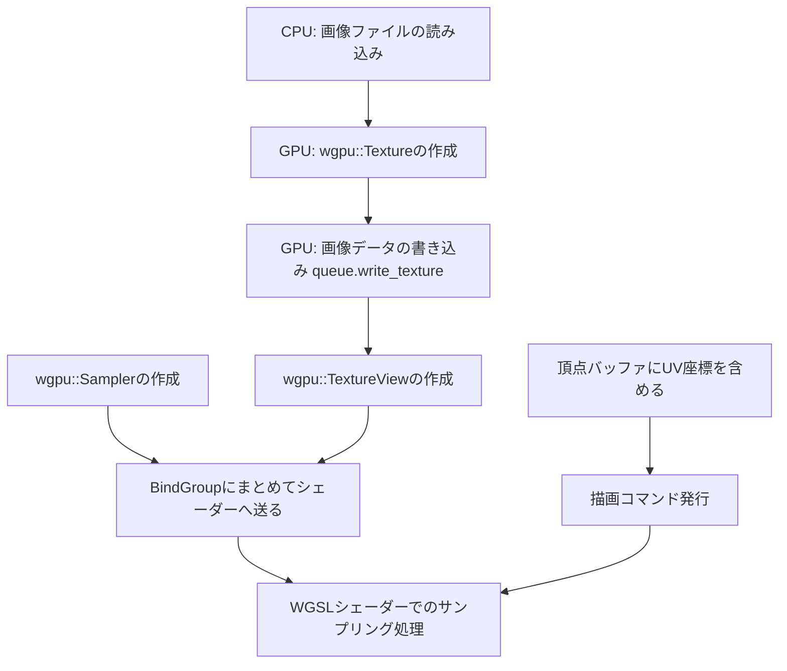

# テクスチャマッピング

## 流れ



## wgpuにおける主要コンポーネント

1. `wgpu::Texture`
    GPUメモリ上に確保される生の画像データ領域。画像の解像度、フォーマット、用途を定義して作成する。
    - `wgpu::TextureDescriptor`:
        - `size`: 幅、高さ、奥行き/レイヤー数
        - `format`: テクスチャのピクセル形式
        - `usage`: `COPY_DST`かつ`TEXTURE_BINDING`にする
2. `wgpu::TextureView`
    `wgpu::Texture`のメモリ領域をどのように解釈して読み込むかを定義する窓口。シェーダーには`wgpu::Texture`ではなくこれを渡す。
    - 「1つの`Texture`が複数の情報を持っていた時、特定の1枚を2Dテクスチャとして読み込む」など、詳細な見方を制御するためにある。通常は通常は`texture.create_view(&wgpu::TextureViewDescriptor::default())` で全体をそのまま見せるビューを作成する。
3. `wgpu::Sampler`
    テクスチャのどの位置からどのように色を取り出すかを決定する設定オブジェクト。
    - `wgpu::SamplerDescriptor`:
        - フィルタリング(`min_filter`, `mag_filter`): テクスチャが拡大・縮小されたときの挙動。
        - アドレスモード(`address_mode_u`, `address_mode_v`): UVが`0.0`~`1.0`の範囲を超えたときの挙動。

## シェーダに渡す

`TextureView`と`Sampler`をシェーダーに送るためにも、バインドグループを使ってひとまとめにする。

## 頂点データとテクスチャ座標(UV)

- UV座標系: テクスチャの左上を(0.0, 0.0)、右下を(1.0, 1.0)と表現するのが一般的。

## WGSLシェーダーでのサンプリング処理

フラグメントシェーダー内では、バインドされた`texture`と`sampler`、補完された`uv`をつかって最終的なピクセルの色を計算(サンプリング)する。

```wgsl
// バインドグループからテクスチャとサンプラーを受け取る
@group(0) @binding(0)
var t_diffuse: texture_2d<f32>;
@group(0) @binding(1)
var s_diffuse: sampler;

struct VertexOutput {
    @builtin(position) clip_position: vec4<f32>,
    @location(0) tex_coords: vec2<f32>, // 補間されたUV座標
};

@fragment
fn fs_main(in: VertexOutput) -> @location(0) vec4<f32> {
    // textureSample 関数を使って、指定のUV座標の色を抽出する
    return textureSample(t_diffuse, s_diffuse, in.tex_coords);
}
```
