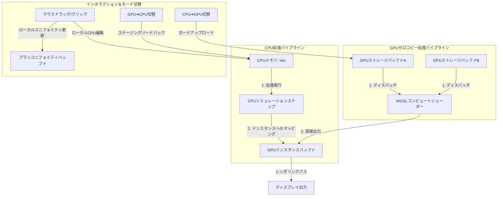

# アーキテクチャガイド：wgpuにおけるCPU/GPUハイブリッドシミュレータの設計

本ドキュメントでは、`fake_water`シミュレータの実装過程で得られたアーキテクチャ上の知見、設計パターン、および開発上の注意点を体系的にまとめています。今後CPU/GPUを動的に切り替え可能なハイブリッドシミュレータ（Boids、セルオートマトン、波動方程式、熱伝導グリッドなど）を開発する際のリファレンスガイドおよびチェックリストとして活用してください。

---

## 1. コアアーキテクチャの概要

CPUモードとGPUモードを動的に切り替え可能なシミュレータを構築する場合、データフローの明確な分離が不可欠です。

以下に主要なデータフローをMermaid記法で可視化します。



---

## 2. 重要なアーキテクチャ上の教訓

### 教訓A: ゼロコピーレンダリング競合問題（レンダリングフリーズ）

コンピュートシェーダーを**ゼロコピーレンダリング**方式で設計した場合――つまりシミュレーション結果を直接GPUインスタンスバッファに書き込む場合――CPUは同じバッファを**操作してはいけません**。

* **落とし穴**: `state.update_instances`のようなCPUマッピング関数を**毎フレーム呼び出す**と、コンピュートシェーダーが直接書き込んだ結果が、凍結した古いCPU状態によって上書きされてしまいます。シミュレーション計算自体はGPU上で正常に実行されますが、グラフィックカードには完全にフリーズした画像が表示されてしまいます。
* **ベストプラクティス**: CPUからGPUへのメモリ転送を行う関数は、必ずアクティブなプロセッサ状態チェックで保護するようにしてください:
  ```rust
  if configs.sys.processor == Processor::CPU {
      state.update_instances(&board.current_squares, board.num_grid_per_row);
  }
  ```

---

### 教訓B: 動的入力データの「上書き」問題

ハイブリッドシミュレーションでは、ユーザー入力（クリック操作、ドラッグ操作、ブラシ操作など）を適切に処理しないと、アクティブなGPUメモリを簡単に破損させてしまう可能性があります。

* **落とし穴**: カーソルのドラッグ操作時にCPUグリッド状態全体（`state.upload_board()`）をレジスタクリック用にアップロードすると、GPUが過去に処理した流体シミュレーションのステップがすべて消去されてしまいます。これはCPUグリッドがGPUモードではシミュレーション更新を処理しないため、常に古い状態になっているからです。
* **ベストプラクティス（統一的な注入方法）**:
  1. モードを切り替えても状態が正確になるよう、CPU側でローカルに状態を更新する。
  2. ボード全体をアップロードするのではなく、ブラシのメタデータ（座標、半径、有効状態、強度）を小さな**Uniform Buffer**に書き込む。
  3. WGSL Compute Shaderが直接GPUスレッド内でブラシの変更を適用できるようにする：
     ```wgsl
     if (brush.is_active == 1u) {
         let dist_sq = dx * dx + dy * dy;
         if (dist_sq <= brush.radius * brush.radius) {
             next_value += brush.strength;
         }
     }
     ```
  この方法により、データ転送に伴う遅延を完全に排除できるとともに、シミュレーション履歴も保護される。

---

### 教訓C: 動的状態同期

CPUとGPU間で動的にトグル操作を行う場合、シミュレーション状態がシームレスに転送され、視覚的なジャンプや履歴の損失が発生しないようにする必要がある。

#### CPU ➔ GPU（アップロード処理）

CPU側の表現をそのまま、両方のダブルバッファ（`buffer_a`と`buffer_b`）にアップロードする：

```rust
pub fn upload_board(&mut self, squares: &[Square]) {
    self.queue.write_buffer(&self.sim_buffers.buffer_a, 0, bytemuck::cast_slice(squares));
    self.queue.write_buffer(&self.sim_buffers.buffer_b, 0, bytemuck::cast_slice(squares));
}
```

#### GPU ➔ CPU（ステージングダウンロード処理）

GPUからデータをダウンロードする場合、`STORAGE`バッファから直接読み取ることはできない。`MAP_READ`バッファにコピーした上で、マッピング処理が完了するまで待機する必要がある。

```rust
pub fn download_board(&mut self, squares: &mut [Square]) {
    let size = (squares.len() * std::mem::size_of::<Square>()) as wgpu::BufferAddress;
    
    // 1. 高速な一時ステージングバッファをMAP_READ用途で作成
    let staging_buffer = self.device.create_buffer(&wgpu::BufferDescriptor {
        label: Some("ダウンロード用ステージングバッファ"),
        size,
        usage: wgpu::BufferUsages::COPY_DST | wgpu::BufferUsages::MAP_READ,
        mapped_at_creation: false,
    });

    let mut encoder = self.device.create_command_encoder(&wgpu::CommandEncoderDescriptor::default());

    // 2. アクティブなピンポンダブルバッファを特定
    let active_buffer = if self.sim_buffers.frame_count % 2 == 0 {
        &self.sim_buffers.buffer_a
    } else {
        &self.sim_buffers.buffer_b
    };

    // 3. GPUにシミュレーションストレージからステージングバッファへのコピーを指示
    encoder.copy_buffer_to_buffer(active_buffer, 0, &staging_buffer, 0, size);
    self.queue.submit(std::iter::once(encoder.finish()));

    // 4. ステージングバッファを非同期でマップし、完了を待つ
    let buffer_slice = staging_buffer.slice(..);
    let (sender, receiver) = std::sync::mpsc::channel();
    buffer_slice.map_async(wgpu::MapMode::Read, move |result| {
        sender.send(result).unwrap();
    });

    // 5. wgpu 29の構文を使用してデバイスをポーリングし、マップコールバックを解決
    self.device.poll(wgpu::PollType::wait_indefinitely()).unwrap();

    if let Ok(Ok(())) = receiver.recv() {
        let data = buffer_slice.get_mapped_range();
        squares.copy_from_slice(bytemuck::cast_slice(&data));
        drop(data);
        staging_buffer.unmap();
    }
}
```

---

## 3. WGSLの技術的注意点とルール

### 注意点1: WGSLで予約されているキーワード

WGSLには厳格に予約されているキーワードが存在し、これらを使用するとシェーダーのコンパイルがサイレントエラーまたはハードエラーで失敗します。

* **重要な例**: `active`はWGSLで予約されているキーワードです。構造体に`active: u32`を格納しようとすると、以下のようなエラーが発生します:
  `Shader 'Shader' parsing error: name 'active' is a reserved keyword`
* **解決策**: `is_active`や`active_flag`のような接頭辞/接尾辞パターンを常に使用することで、安全にコーディングできます。

### 注意点2: ホスト側とデバイス側の構造体アライメント

WGSLバッファでは、構造体が厳密なバイト単位のアライメント規則に従う必要があります（例えばベクトル型の場合は16バイト境界など）。

- **注意点**: Rustの`InstanceRaw`構造体で`position: [f32; 3]`や`color: [f32; 4]`のようなフィールドを定義した場合、CPU上ではこれらが密にパックされて**32バイト**でコンパイルされますが、WGSLでは`vec3`や`vec4`が16バイト間隔でパディングされるため、GPU上では**48バイト**でコンパイルされます。この不一致が原因でインスタンスレンダリングが乱雑になります。
- **解決策**: WGSL側では、構造体フィールドをフラットな`f32`プリミティブとして再定義します:
  ```wgsl
  struct InstanceRaw {
      pos_x: f32,
      pos_y: f32,
      pos_z: f32,
      color_r: f32,
      color_g: f32,
      color_b: f32,
      color_a: f32,
      scale: f32,
  }
  ```
  これにより、GPU上では完全にフラットな32バイトレイアウトが強制され、Rust側の`[f32; 3]`、`[f32; 4]`、および`f32`のストライドと完全に一致します。

---

## 4. ハイブリッドシミュレータの確認リスト

新しいシミュレータを作成する際には、以下の項目を必ず確認してください:

- [ ] **デュアルバッファ設定**: GPU上でピンポン計算を行うための`buffer_a`と`buffer_b`を正しく初期化しましたか？
- [ ] **更新処理の保護**: `update_instances`（CPU側マッピング）は`Processor::CPU`モードの背後でロックされており、コンピュートシェーダーの出力を上書きしないようにしていますか？
- [ ] **状態遷移イベント**: モード変更を検知する`last_processor`トラッカーは存在しますか？モード変更が検出された場合、GPU→CPU間で`download_board`を、CPU→GPU間で`upload_board`をトリガーしますか？
- [ ] **インタラクション用ユニフォーム**: カーソルのクリックや入力はローカルで処理され、`BrushUniform`を使用して、シミュレーション中にCPUボード全体の状態をアップロードしないようにしていますか？
- [ ] **GPU用フラット構造体**: WGSL構造体のフィールドは、`vec3`や`vec4`ではなくフラットなプリミティブ型（`f32` / `u32`）にマッピングされていますか？これにより、Rust側の`#[repr(C)]`レイアウトと完全に一致するバイトストライドが保証されますか？
- [ ] **WGSLキーワードの準拠**: 構造体フィールド名には予約語が含まれていませんか？（例：`active`ではなく`is_active`を使用するなど）