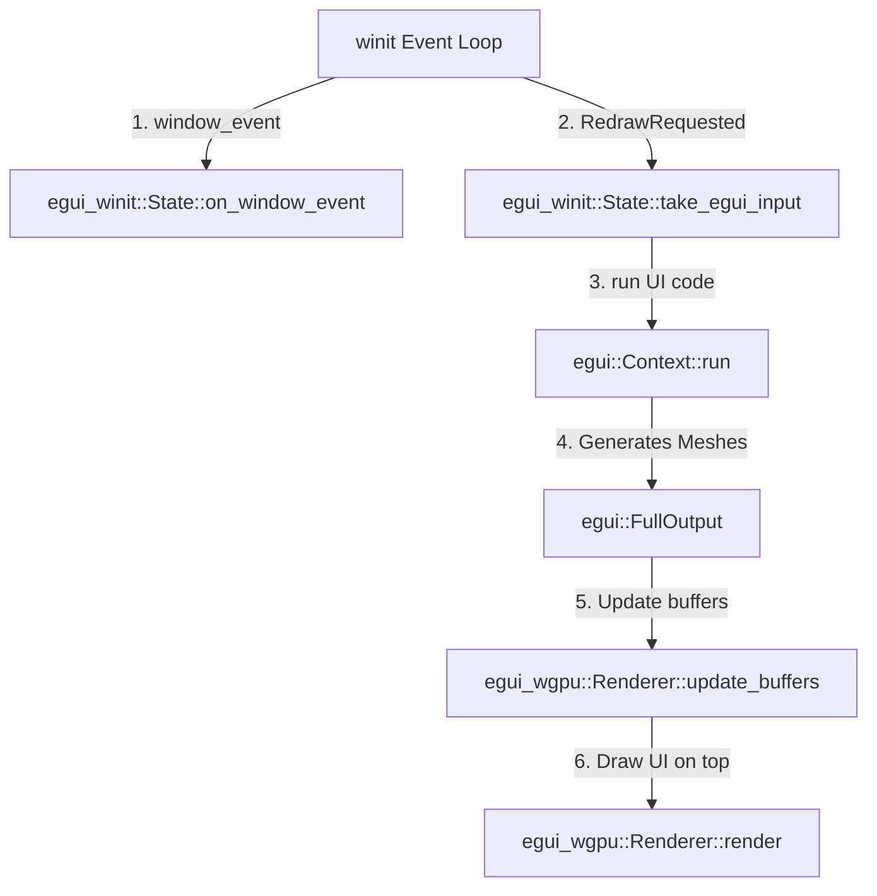

# 🎨 wgpu × winit egui マニュアル統合・実装ガイド（egui v0.34+ 最新版対応）

このドキュメントは、最新の **`egui-winit (0.34.2+)`** および **`egui-wgpu (0.34.2+)`** の変更された関数シグネチャに完全対応した、winit + wgpu 環境へのマニュアル統合手順書です。

---

## 🧭 全体のアーキテクチャとデータフロー

マニュアル統合では、いつものシミュレーション更新と描画のループに、以下のように egui の「入力伝達」と「UI描画」を割り込ませます。



---

## 🛠️ ステップ①：`state.rs`（レンダラー側）の実装手順

`State` 構造体は、GPUを使って **egui のUIメッシュを描画する役割** を担います。

### 1. 必要なモジュールのインポート
```rust
use egui_wgpu::Renderer as EguiRenderer;
use egui_wgpu::RendererOptions; // ➔ 最新版で必要
```

### 2. `State` 構造体へのフィールド追加
```rust
pub struct State {
    // ... 既存のフィールド
    pub egui_renderer: EguiRenderer, // egui専用のwgpuレンダラー
}
```

### 3. `State::new` での初期化
> [!IMPORTANT]
> 最新の `egui-wgpu` では、第3引数に `None` ではなく **`RendererOptions`** 構造体（デフォルトなら `RendererOptions::default()`）を直接渡す必要があります。

```rust
let egui_renderer = EguiRenderer::new(
    &device,
    config.format, // 画面と同じカラーフォーマット
    RendererOptions::default(), // ➔ 最新版の仕様 (defaultを指定)
);
```

### 4. `State::render` での描画割り込み
ライフゲームのメイン描画を行う **`render_pass` の終了直後** に、eguiの描画処理を挿入します。

```rust
pub fn render(&mut self, paint_jobs: &[egui::epaint::ClippedPrimitive], screen_descriptor: &egui_wgpu::ScreenDescriptor) {
    let frame = self.surface.get_current_texture().unwrap();
    let view = frame.texture.create_view(&wgpu::TextureViewDescriptor::default());
    let mut encoder = self.device.create_command_encoder(&wgpu::CommandEncoderDescriptor::default());

    // ─────────────────────────────────────────────────────────────
    // 1. egui の頂点バッファ・インデックスバッファを更新してGPUに送る
    // ─────────────────────────────────────────────────────────────
    self.egui_renderer.update_buffers(
        &self.device,
        &self.queue,
        &mut encoder,
        paint_jobs,
        screen_descriptor,
    );

    // ─────────────────────────────────────────────────────────────
    // 2. 既存の描画 (ライフゲームなど) のレンダーパス
    // ─────────────────────────────────────────────────────────────
    {
        let mut render_pass = encoder.begin_render_pass(&wgpu::RenderPassDescriptor {
            label: Some("Main Render Pass"),
            color_attachments: &[Some(wgpu::RenderPassColorAttachment {
                view: &view,
                resolve_target: None,
                depth_slice: None,
                ops: wgpu::Operations {
                    load: wgpu::LoadOp::Clear(wgpu::Color::BLACK), // 画面クリア
                    store: wgpu::StoreOp::Store,
                },
            })],
            depth_stencil_attachment: None,
            timestamp_writes: None,
            occlusion_query_set: None,
            multiview_mask: None,
        });

        // ライフゲームの描画コマンド
        render_pass.set_pipeline(&self.render_pipeline);
        render_pass.set_vertex_buffer(0, self.vertex_buffer.slice(..));
        render_pass.set_vertex_buffer(1, self.instance_buffer.slice(..));
        render_pass.draw(0..self.num_vertices, 0..self.num_instances as u32);
    } // ➔ ここでメインの描画パスが終了

    // ─────────────────────────────────────────────────────────────
    // 3. egui GUI のレンダーパス (メイン描画の上に重ね描きする)
    // ─────────────────────────────────────────────────────────────
    {
        // 重要: 最新の egui_wgpu の render 関数は 'static ライフタイムの RenderPass を要求します。
        // そのため、.forget_lifetime() を呼び出してライフタイムチェックをランタイムに移す必要があります。
        let mut egui_pass = encoder.begin_render_pass(&wgpu::RenderPassDescriptor {
            label: Some("egui Render Pass"),
            color_attachments: &[Some(wgpu::RenderPassColorAttachment {
                view: &view,
                resolve_target: None,
                depth_slice: None,
                ops: wgpu::Operations {
                    // 重要: LoadOp::Load にすることで、メイン描画を消さずに上に重ねます！
                    load: wgpu::LoadOp::Load, 
                    store: wgpu::StoreOp::Store,
                },
            })],
            depth_stencil_attachment: None,
            timestamp_writes: None,
            occlusion_query_set: None,
            multiview_mask: None,
        }).forget_lifetime(); // ➔ forget_lifetime() を呼び出して 'static にする

        // eguiレンダラーを使ってUIを描画
        self.egui_renderer.render(&mut egui_pass, paint_jobs, screen_descriptor);
    }

    self.queue.submit(std::iter::once(encoder.finish()));
    frame.present();
}
```

---

## 🛠️ ステップ②：`app.rs`（winit・システム側）の実装手順

`App` 構造体は、winitからの入力を egui に伝え、**UIの論理ツリー（スライダーやボタンなど）を定義して実行する役割** を担います。

### 1. 必要なモジュールのインポート
```rust
use egui::Context as EguiContext;
use egui_winit::State as EguiState;
```

### 2. `App` 構造体へのフィールド追加
```rust
pub struct App {
    window: Option<Arc<Window>>,
    state: Option<State>,
    pub board: Option<Board>,
    
    // egui用の状態を追加
    egui_ctx: EguiContext,
    egui_state: Option<EguiState>,
}
```
※ `App` の `Default` 実装（`#[derive(Default)]` または `impl Default`）で、`egui_ctx: EguiContext::default()` を初期化するようにしてください。

### 3. `resumed` での初期化
> [!IMPORTANT]
> 最新の `egui-winit (0.34+)` では、`State::new` のシグネチャに **`egui::ViewportId`** が必要で、全体の引数は **6個** に変更されています。
> * 第2引数: メインウィンドウなので `egui::ViewportId::ROOT` を指定します。
> * 第3引数: `HasDisplayHandle` トレイトを実装するウィンドウ（`&window` 等）を指定します。
> * 第5引数: `Option<Theme>` (デフォルトテーマのオーバーライド、不要なら `None`)
> * 第6引数: `Option<usize>` (テクスチャサイズの最大制限、不要なら `None`)
> * ※ 以前のバージョンに存在した `clipboard` 引数は廃止され、第3引数の `display_target` から内部で自動的に初期化されるようになりました。

```rust
fn resumed(&mut self, event_loop: &winit::event_loop::ActiveEventLoop) {
    let window = Arc::new(
        event_loop
            .create_window(Window::default_attributes().with_title("wgpu lifegame"))
            .unwrap(),
    );

    let state = pollster::block_on(State::new(Arc::clone(&window), INITIAL_NUM_GRID_PER_ROW * INITIAL_NUM_GRID_PER_ROW));
    
    // egui_state の初期化
    // ➔ 最新の egui-winit (0.34.2+) では、引数が 6 個に変更されています。
    // クリップボードは display_target から内部で自動生成されるようになり、引数から削除されました。
    let egui_state = EguiState::new(
        self.egui_ctx.clone(),
        egui::ViewportId::ROOT, // 第2引数: ビューポートID (ROOT)
        &window,                // 第3引数: HasDisplayHandle を実装するウィンドウ
        None,                   // 第4引数: native_pixels_per_point (None で自動検出)
        None,                   // 第5引数: system_theme (Option<Theme>)
        None,                   // 第6引数: max_texture_side (Option<usize>)
    );

    self.window = Some(window);
    self.state = Some(state);
    self.board = Some(Board::new(INITIAL_NUM_GRID_PER_ROW));
    self.egui_state = Some(egui_state);
}
```

### 4. `window_event` での入力の転送
イベントループに届いた winit のマウス・キー入力イベントを、egui にそのまま転送して処理させます。

```rust
fn window_event(...) {
    // 1. egui_state にイベントを中継して処理させる
    if let Some(egui_state) = &mut self.egui_state {
        let response = egui_state.on_window_event(self.window.as_ref().unwrap(), &event);
        
        // 重要: もしイベントが「GUIに対する操作」だった場合、ゲーム側の処理を自動で無視する！
        if response.consumed {
            return; // UI上のクリックなどがゲーム盤面に貫通するのを防ぎます
        }
    }

    match event {
        // 既存の winit イベント処理 (Resized, CloseRequested など...)
    }
}
```

### 5. `RedrawRequested` での UI 構築とレンダラーへの受け渡し
> [!IMPORTANT]
> 最新の `egui` (v0.24 以降) では、フレームの開始・終了メソッドが `begin_frame` / `end_frame` から **`begin_pass`** と **`end_pass`** に名称変更されています。

```rust
WindowEvent::RedrawRequested => {
    if let (Some(state), Some(board), Some(window), Some(egui_state)) = (
        &mut self.state,
        &mut self.board,
        &self.window,
        &mut self.egui_state,
    ) {
        // 1. ゲームロジックの更新
        board.update();

        // 2. egui の入力フレームを開始 (begin_pass を使用)
        let raw_input = egui_state.take_egui_input(window);
        self.egui_ctx.begin_pass(raw_input); // ➔ 最新版の仕様

        // ─────────────────────────────────────────────────────────────
        // 3. ここに GUI (eguiのウィンドウやウィジェット) を記述！
        // ─────────────────────────────────────────────────────────────
        egui::Window::new("⚙️ Settings").show(&self.egui_ctx, |ui| {
            ui.label("LifeGame Simulator Control Panel");
            
            if ui.button("🔄 Reset Board").clicked() {
                // ボードのリセット処理などを呼び出す
            }
        });

        // ─────────────────────────────────────────────────────────────
        // 4. GUI フレームを終了し（end_pass）、描画用のメッシュに変換
        // ─────────────────────────────────────────────────────────────
        let egui_output = self.egui_ctx.end_pass(); // ➔ 最新版の仕様
        
        // winitのプラットフォーム連携（カーソルアイコンの変更などを処理）
        egui_state.handle_platform_output(window, egui_output.platform_output);

        // ─────────────────────────────────────────────────────────────
        // 【重要】テクスチャ（フォント等）のGPU側への追加・削除を同期
        // ─────────────────────────────────────────────────────────────
        // これを行わないと、文字（フォントテクスチャ）やパネル用テクスチャがGPUに
        // アップロードされず、GUI全体が非表示（または透明）になってしまいます！
        for (id, image_delta) in &egui_output.textures_delta.set {
            state.egui_renderer.update_texture(&state.device, &state.queue, *id, image_delta);
        }
        for id in &egui_output.textures_delta.free {
            state.egui_renderer.free_texture(id);
        }

        // 描画用のメッシュを生成
        let paint_jobs = self.egui_ctx.tessellate(egui_output.shapes, egui_output.pixels_per_point);

        // レンダラーに渡す画面記述子（アスペクト比や解像度）を作成
        let screen_descriptor = egui_wgpu::ScreenDescriptor {
            size_in_pixels: [state.config.width, state.config.height],
            pixels_per_point: egui_output.pixels_per_point,
        };

        // 5. ゲームのインスタンスバッファを同期
        state.update_instances(board.cells(), board.num_grid_per_row, 0.0);

        // 6. レンダリング実行 (メッシュと画面情報を渡して重ね描きさせる)
        state.render(&paint_jobs, &screen_descriptor);
    }
}
```

---

## 💡 知っておくと役立つ「極意」のヒント

### 🛡️ 背後へのクリック貫通問題（Wants Input Guard）
GUIのウィンドウをクリックした際、その真後ろにあるライフゲームのマスまで「クリックされた」と判定されて石が置かれてしまう問題（クリック貫通）がよく起きます。

これを防ぐために、ゲーム側のマウスクリック判定イベント（`WindowEvent::MouseInput`）の中で、以下のように **`wants_pointer_input`** ガードを挟んでください。

```rust
WindowEvent::MouseInput { state: button_state, button: MouseButton::Left, .. } => {
    // マウスカーソルが現在 GUI の上に乗っている場合は、ゲーム盤面のクリック判定を無視する！
    if self.egui_ctx.wants_pointer_input() {
        return;
    }
    
    // 以下に通常の盤面クリック処理...
}
```
* **`self.egui_ctx.wants_pointer_input()`**：マウスがGUIウィンドウやボタンの上に乗っている時に `true` を返します。
* **`self.egui_ctx.wants_keyboard_input()`**：GUIのテキスト入力欄などに文字を入力している時に `true` を返します（ゲームのキー操作がテキスト入力と被るのを防ぎます）。
