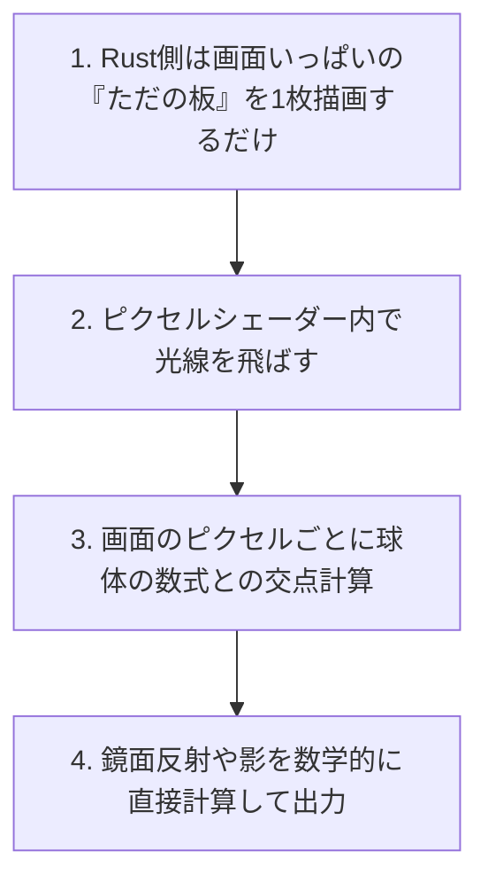

# レイトレーシング化

現在の「ラスタライズ方式」から「レイトレーシング方式」へ移行する場合、**実装の難易度とコードの書き方は劇的に（完全に別次元に）変化します**。

低レベルAPIであるwgpuにおいて、レイトレーシングを実装するには主に**2つのアプローチ**があります。それぞれどれくらい実装が変わるかを解説します。

## アプローチ A：シェーダー内で数学的に自作する（難易度：★★★☆☆）

「頂点バッファ」や「3Dモデルデータ」を一切使わず、**シェーダー（WGSL）の中だけで、光線と球体の衝突を数学的にすべて計算する手法**です。
（※この手法は特に「レイマーチング（Ray Marching）」や「SDF（符号付き距離関数）」と呼ばれます）



### 🛠️ 実装の変更点

*   **Rustコード（CPU側）は「超絶シンプル」になる**:
    球体の頂点計算（`generate_uv_sphere`）やインデックスバッファ、MVP行列（カメラ）の計算は**すべて不要**になります。Rust側は、画面を覆うだけの「2つの三角形（1枚の板）」を描画するだけになります。
*   **シェーダーコード（GPU側）が「数学の数式だらけ」になる**:
    ピクセルシェーダーの中で、以下のような物理・数学のコードを自前で実装します：
    1.  カメラ位置から画面の各ピクセルに向かう「光線ベクトル（Ray）」を定義する。
    2.  光線と球体の衝突判定を二次方程式の解の公式 $D = b^2 - 4ac$ などで解く。
    3.  衝突した点から、さらに「光源」に向かって光線を飛ばし、途中に球体があれば「影（シャドウ）」にする。
    4.  衝突した点から「反射ベクトル」を計算してもう一度飛ばし、床に当たれば「床の色が球体に映り込む（反射）」ようにする。

### 🌟 メリット

wgpuの標準的な機能（バッファを数個送るだけ）だけで実装できるため、**数千行のRustコードを書くことなく、シェーダーだけで息を呑むようなリアルな鏡面反射や屈折が表現できます。**（※ShaderToyなどで公開されている美しい3Dグラフィックスはほぼこの技術です）

## アプローチ B：GPUのハードウェア機能（RTコア）を使う（難易度：★★★★★）

NVIDIAのGeForce RTXシリーズなどに搭載されている「レイトレーシング専用コア（RT Core）」をwgpuから直接叩く、**プロのゲームエンジンが採用する本物の手法**です。

```mermaid
graph TD
    Model[1. 複雑な3Dモデルデータ] --> BVH[2. 加速構造 (BVH) の構築]
    BVH --> GPURT[3. GPU専用のレイトレーシングパイプライン]
    GPURT --> HitShader[4. 交差・ヒットシェーダー群の実行]
```

### 🛠️ 実装の変更点

実装の難易度は**「爆上がり（次元が異なる難しさ）」**します。wgpuのコード量は軽く数千行を超えます。

1.  **「加速構造（Acceleration Structure / BVH）」の構築**:
    光線がどのポリゴンに当たったかをGPUが超高速に検索できるように、3Dモデルを包み込む「境界ボリューム階層ツリー（BVH）」という特殊なデータ構造をメモリ上に構築し、毎フレームGPUに転送する必要があります。
2.  **レイトレーシング・パイプラインの導入**:
    現在の `RenderPipeline` の代わりに、`RayTracingPipeline` という特殊なパイプラインを構築します。
3.  **シェーダーの超細分化**:
    現在のシェーダーのような「頂点」「ピクセル」の2段階ではなく、以下のような大量の専用シェーダーを組み合わせて協調動作させます：
    *   `Ray Generation Shader` (光線を発生させる)
    *   `Closest Hit Shader` (一番手前で当たった時の色の計算)
    *   `Miss Shader` (何にも当たらず宇宙に抜けた時の空の色)
    *   `Intersection Shader` (当たり判定のカスタム計算)

### 🌟 メリット

何億ポリゴンもある超巨大で複雑な3Dキャラクターや建物の間を光線が飛び交うような、本格的なオープンワールドゲームでもリアルタイムでレイトレーシングが動作します。
