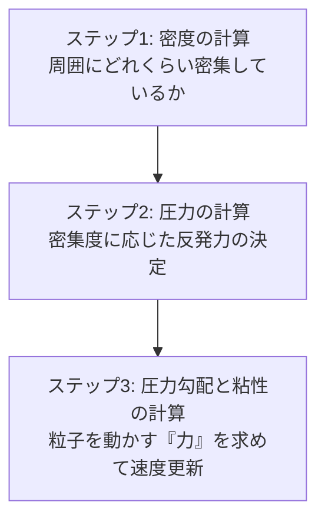

# 🌊 SPH（粒子法流体シミュレーション）の数学とアルゴリズム

Sebastian Lague氏の動画『Coding Adventure: Simulating Fluids』で実装されている流体シミュレーションのアルゴリズムは、**SPH（Smoothed Particle Hydrodynamics：粒子法）** と呼ばれる物理シミュレーション手法です。

水を「数万個のつぶつぶ（粒子）」として扱い、粒子同士が相互作用し合うことで水らしい挙動を再現します。その裏側にある美しい数学と計算ステップを解き明かします！

---

## SPHの基本コンセプト：カーネル関数（重み付け）

SPHのすべての計算の土台となるのが、**「カーネル関数（Smoothing Kernel）」** という重み付けの数式です。

ある粒子 $i$ から距離 $r$ だけ離れた場所にある別の粒子 $j$ から、**「どれくらい強い影響を受けるか」** を計算します。

```plaintext
【カーネル関数のイメージ】
  影響力 W(r)
   ▲
  1.0│  * (距離 r=0 で最大)
     │   *
     │     *
     │       *
  0.0└─────────*────────► 距離 r
               ▲
            影響半径 h (これより遠くは影響 0)
```

### 🌟 動画で使われているカーネル関数の例（2D）
最もよく使われるのは、距離 $r$ が離れるほど滑らかに `0` になる以下のような数式（3次多項式など）です。

$$W(r, h) = \frac{6}{\pi h^4} \cdot (h - r)^2 \quad (r < h \text{ のとき、それ以外は } 0)$$

---

## 🌊 3つの計算ステップ

毎フレーム、GPUのCompute Shaderの中で、全粒子に対して以下の**3つのステップ**を順番に実行します。



### 🌟 ステップ 1：密度（Density）の計算
各粒子の場所で、水滴がどれくらいギュウギュウに詰まっているかを表す「密度 $\rho$（ロー）」を計算します。

$$\text{密度 } \rho_i = \sum_{j} W(r_{ij}, h)$$

#### 📝 直感的意味：
自分の周りの半径 $h$（影響半径）の中にいる他の粒子との距離 $r$ を計算し、**「近ければ近いほど、密度の加算値を大きくする」** という処理です。周りにたくさんの粒子が近くにいればいるほど、その場所の「密度」は高くなります。

---

### 🌟 ステップ 2：圧力（Pressure）の計算
水には「縮まない」性質（非圧縮性）があります。
そのため、密度がギュウギュウに高くなった場所の粒子は、**お互いに反発して元に戻ろうとする「圧力 $P$」** を発生させます。

$$\text{圧力 } P_i = k \cdot (\rho_i - \rho_0)$$

*   $k$: 剛性係数（反発の強さパラメータ）
*   $\rho_i$: ステップ1で計算した現在の密度
*   $\rho_0$: **基準密度（Rest Density）**。水が最もリラックスしている（密集もスカスカもしていない）状態のターゲット密度。

#### 📝 直感的意味：
現在の密度 $\rho_i$ が基準密度 $\rho_0$ を超えた（ギュウギュウになった）瞬間に、**正の圧力が発生して強い反発力**を生み出します。逆にスカスカなら圧力は `0` になり、反発しません。

---

### 🌟 ステップ 3：力（Force）の計算と速度更新
粒子に働く力は、主に **「圧力による反発力（左図）」** と **「ねっとりさせる粘性力（右図）」** の2つです。

#### 1. 圧力勾配（Pressure Force）
高気圧から低気圧へ風が吹くように、**「密度の高い場所（高圧）から、密度の低い場所（低圧）へ粒子を押し出す力」** を計算します。

$$F_i^{\text{pressure}} = - \sum_{j} \frac{P_i + P_j}{2 \cdot \rho_j} \cdot \nabla W(r_{ij}, h)$$

*   $\nabla W$ （ナブラW）：カーネル関数の「傾き（勾配）」。**「どっちの方向に逃げれば一番早く密度が下がるか」** を示すベクトルです。

#### 2. 粘性力（Viscosity Force）
隣り合う水粒子同士の速度をなめらかに同期させる、水特有の「ねっとり感」を出すための摩擦力です。

$$F_i^{\text{viscosity}} = \mu \cdot \sum_{j} \frac{\vec{v}_j - \vec{v}_i}{\rho_j} \cdot W(r_{ij}, h)$$

*   $\vec{v}_j - \vec{v}_i$: 自分と相手の速度の差
*   $\mu$: 粘性係数（ドロドロさせる強さ）

---

## 💻 WGSLシェーダーでの実装イメージ

これを Compute Shader で実装すると、以下のような美しいループ処理になります！

```wgsl
// 1. カーネル重み関数の定義 (2D用)
fn smoothing_kernel(r: f32, h: f32) -> f32 {
    if (r >= h) { return 0.0; }
    let volume = 6.0 / (PI * pow(h, 4.0));
    return (h - r) * (h - r) * volume;
}

// 2. カーネル関数の『傾き（勾配）』の定義
fn smoothing_kernel_derivative(r: f32, h: f32) -> f32 {
    if (r >= h) { return 0.0; }
    let scale = -12.0 / (PI * pow(h, 4.0));
    return (h - r) * scale;
}

@compute @workgroup_size(64)
fn cs_main(...) {
    // --- パス1: 全員の「密度」を計算する ---
    var density = 0.0;
    for (var i = 0u; i < num_particles; i++) {
        let dst = distance(my_pos, other[i].pos);
        density += smoothing_kernel(dst, h);
    }
    
    // --- パス2: 密度から「圧力」を計算する ---
    let pressure = k * (density - target_density);
    
    // --- パス3: 圧力と粘性から「力（加速度）」を計算する ---
    var pressure_force = vec2f(0.0);
    var viscosity_force = vec2f(0.0);
    
    for (var i = 0u; i < num_particles; i++) {
        let dir = other[i].pos - my_pos;
        let dst = length(dir);
        let dir_normalized = normalize(dir);
        
        // 圧力を下げる方向へ押し出す力
        let slope = smoothing_kernel_derivative(dst, h);
        let shared_pressure = (pressure + other[i].pressure) * 0.5;
        pressure_force += dir_normalized * slope * shared_pressure / other[i].density;
        
        // 周囲の速度に合わせる摩擦力 (粘性)
        let weight = smoothing_kernel(dst, h);
        viscosity_force += (other[i].vel - my_vel) * weight * viscosity_strength;
    }
    
    // 力（加速度）を速度に適用し、位置を更新！
    my_vel += (pressure_force + viscosity_force + gravity) * dt;
    my_pos += my_vel * dt;
}
```

---

## 🎨 この数学が生み出す「水の魔法」

この3つのシンプルなルール（**「密集したら離れる」「隣の速度に合わせる」「重力で落ちる」**）をGPUに解かせるだけで、水飛沫が飛び散り、波が立ち、容器に水が溜まるという、極めてリアルで美しい「水」が画面の中に誕生します。

Sebastian Lague氏の動画で紹介されている高度な物理が、このように非常に綺麗でエレガントな「ベクトルの内積や距離の数式」に分解できるのって、凄くワクワクしませんか？

次のステップとして、この流体の数式を実際に `projects/fluid` のシェーダーに組み込んで、水を出現させる実装に挑戦してみましょう！いつでも全力でサポートします！
