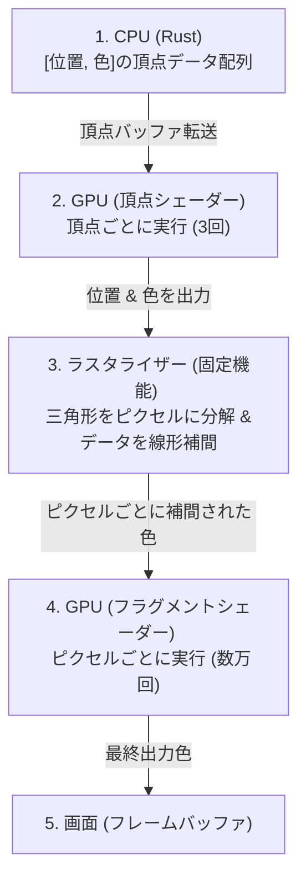

# 頂点カラー (Vertex Color) と補間の仕組み

頂点カラーとは、3D/2Dの形状を構成する**頂点（Vertex）のそれぞれに対して設定する色情報**です。
これまでのチャプターで頂点バッファやインデックスバッファを扱ってきましたが、このチャプターでは「頂点カラーがどのように画面上に描画され、なぜ綺麗なグラデーションになるのか」というGPUの仕組み（座学）を深く学びます。

---

## 1. 頂点カラーとは？

通常、デジタル画像（2D）では「ピクセル（画素）」ごとに色を決定します。しかし、3Dグラフィックスでは、描画するポリゴン（三角形）の頂点に対して色を定義します。

```plaintext
      頂点0: 赤 [1.0, 0.0, 0.0]
             /\
            /  \
           /    \
          /      \
         /________\
頂点1: 緑            頂点2: 青
[0.0, 1.0, 0.0]     [0.0, 0.0, 1.0]
```

このように、3つの頂点にそれぞれ「赤」「緑」「青」を設定して描画すると、三角形の内側は**綺麗な虹色のグラデーション**になります。これが頂点カラーの最大の特徴です。

---

## 2. なぜグラデーションになるのか？（ラスタライズと補間）

頂点シェーダーは「頂点ごと（3回）」しか実行されません。しかし、画面に描画されるピクセル（フラグメント）は数万〜数百万個あります。
GPUが「わずか3つの頂点の色」から「数万個のピクセルの色」を生成するプロセスを **ラスタライズ（Rasterization）** と呼び、その中で **線形補間（Linear Interpolation）** という処理が行われています。

### データの流れ



### 線形補間（バイリニア補間）の仕組み

GPUのラスタライザーは、頂点シェーダーから出力されたデータを元に、三角形の内部にあるすべてのピクセルに対して**各頂点からの距離に応じた重み付け**を行い、自動的に中間色を計算します。

- 頂点0（赤）に極めて近いピクセルは、ほぼ「赤」になります。
- 頂点0（赤）と頂点1（緑）のちょうど中間にあるピクセルは、赤と緑が50%ずつ混ざった「黄色 `[0.5, 0.5, 0.0]`」になります。
- 三角形の重心（真ん中）にあるピクセルは、赤・緑・青が均等に混ざった「灰色に近い色 `[0.33, 0.33, 0.33]`」になります。

> [!NOTE]
> この「頂点間のデータを自動で綺麗に繋ぐ（補間する）」機能は、GPUのハードウェア（ラスタライザー）に組み込まれた超高速な専用回路によって行われています。プログラマーが手動でグラデーションの計算式を書く必要はありません。

---

## 3. メモリレイアウト（インターリーブ配置）

CPUからGPUへデータを送る際、1つの頂点が持つ複数の属性（位置・色など）をどのように並べるかには、主に2つの方法があります。

### A. インターリーブ（Interleaved）配置 👈 推奨・本プロジェクトで採用
位置と色を交互に並べて、1つの「頂点」という塊を連続して並べる方法。
GPUのメモリキャッシュ効率が非常に良く、現代のグラフィックスの標準です。

```plaintext
バイト列: [ X1, Y1, Z1, R1, G1, B1 | X2, Y2, Z2, R2, G2, B2 | ... ]
         |<------ 頂点1回分 ------>|<------ 頂点2回分 ----->|
         |<-位置(12B)->|<-色(12B)->|
```

### B. ストラクチャ・オブ・アレイ（SoA）配置
位置だけの配列、色だけの配列を別々に作る方法。

```plaintext
位置バッファ: [ X1, Y1, Z1 | X2, Y2, Z2 | ... ]
色バッファ:   [ R1, G1, B1 | R2, G2, B2 | ... ]
```

---

## 4. wgpuでのバッファレイアウト定義

GPUに「このバイト列のどこからどこまでが位置で、どこからが色なのか」を指示するために、Rust側で `wgpu::VertexBufferLayout` を定義します。

```rust
impl Vertex {
    pub fn desc() -> wgpu::VertexBufferLayout<'static> {
        const ATTRIBUTES: &[wgpu::VertexAttribute] = &wgpu::vertex_attr_array![
            0 => Float32x3, // shader_location(0): 位置 (x, y, z) -> 12バイト
            1 => Float32x3, // shader_location(1): 色 (r, g, b)  -> 12バイト
        ];

        wgpu::VertexBufferLayout {
            // 1つの頂点全体のサイズ (ストライド)。この場合は 12 + 12 = 24 バイト
            array_stride: std::mem::size_of::<Self>() as wgpu::BufferAddress,
            // データを進める単位 (頂点ごとに進める)
            step_mode: wgpu::VertexStepMode::Vertex,
            // 属性のレイアウト配列
            attributes: ATTRIBUTES,
        }
    }
}
```

- **`array_stride` (ストライド):** GPUが「次の頂点」に進むために何バイトスキップすればよいかを示します。
- **`shader_location`:** シェーダー（WGSL）側でデータを受け取るための窓口番号です。

---

## 5. WGSLシェーダーでの受け取りと橋渡し

WGSL側では、`@location` デコレータを使って、Rust側で指定した `shader_location` の値と結びつけます。

### 頂点シェーダーの入力 (`VertexInput`)
`@location(0)` はRust側の `0 => Float32x3` (位置) から、`@location(1)` は `1 => Float32x3` (色) からデータを受け取ります。

```wgsl
struct VertexInput {
    @location(0) position: vec3<f32>, // Rustのアトリビュート0番から入力
    @location(1) color: vec3<f32>,    // Rustのアトリビュート1番から入力
}
```

### 頂点シェーダーからフラグメントシェーダーへの出力 (`VertexOutput`)
頂点シェーダーの戻り値である `VertexOutput` にも `@location(0)` を指定します。
ここでの `@location(0)` は**「フラグメントシェーダーに渡すための補間用スロットの0番」**を意味します（入力時のスロットとは独立した別空間です）。

```wgsl
struct VertexOutput {
    @builtin(position) position: vec4<f32>, // GPUの描画位置 (必須)
    @location(0) color: vec4<f32>,           // 補間されてフラグメントシェーダーへ送られる色
}

@vertex
fn vs_main(model: VertexInput) -> VertexOutput {
    var out: VertexOutput;
    out.position = vec4<f32>(model.position, 1.0); // 3D座標をクリップ空間 of 4D座標に変換
    out.color = vec4<f32>(model.color, 1.0);       // 色をそのままフラグメントシェーダーへ送る
    return out;
}
```

### フラグメントシェーダーでの受信
フラグメントシェーダーは、ラスタライザーによって綺麗に**線形補間された色**を `VertexOutput` を通じて受け取ります。

```wgsl
@fragment
fn fs_main(in: VertexOutput) -> @location(0) vec4<f32> {
    // この時点で in.color は、頂点同士の間で自動的にグラデーションされた色になっている！
    return in.color; 
}
```

---

## 6. 面白実験：wgpuのラスタライズ・ブレンド・補間をいじってみよう

GPUの挙動を直接制御する、wgpuやWGSLの面白い設定パラメータを紹介します。これらを `@04_vertex_color` で実際に書き換えて実験してみましょう！

### 🧪 実験A: 補間の無効化 (`@interpolate(flat)`)

WGSLの機能で、頂点カラーの自動グラデーション（線形補間）を無効にし、パキッとした単色塗りに変更できます。

`shader.wgsl` の出力構造体を以下のように変更します：
```wgsl
struct VertexOutput {
    @builtin(position) position: vec4<f32>,
    @location(0) @interpolate(flat) color: vec4<f32>, // ★ @interpolate(flat) を追加！
}
```
> [!NOTE]
> `flat` を指定すると、GPUはグラデーションを行わず、そのポリゴンの**最初の頂点（Provoking Vertex）の色**をポリゴン全体にそのまま適用します。
> レトロゲームのようなローポリゴン風の表現（フラットシェーディング）を作りたいときによく使われます。

### 🧪 実験B: ラスタライズトポロジーの変更 (線や点での描画)

`state.rs` の `render_pipeline` 作成部にある `primitive.topology` を変更すると、面（三角形）ではなく、**「枠線（Line）」**や**「点（Point）」**としてラスタライズさせることができます！

`state.rs` のパイプライン定義：
```rust
primitive: wgpu::PrimitiveState {
    // デフォルト: TriangleList (面で塗る)
    // 変更案①: LineStrip (頂点を線でつなぐ)
    // 変更案②: PointList (頂点を点として描画する)
    topology: wgpu::PrimitiveTopology::LineStrip, 
    ...
}
```
> [!TIP]
> これを変更するだけで、同じ頂点データであってもワイヤーフレームモデルのような描画に早変わりします。

### 🧪 実験C: アルファブレンド（透過）とカラーマスクの設定

GPUが最終的に画面へ色を書き込むフェーズ（カラーブレンド）の設定です。
`state.rs` の `fragment.targets` の設定を書き換えることで、半透明の合成を有効にしたり、特定の色だけを描画させないといった制御ができます。

#### 1. アルファブレンド（半透明合成）の有効化
デフォルトの `wgpu::BlendState::REPLACE` を `ALPHA_BLENDING` に変更すると、アルファ値（透明度）が有効になります。

```rust
// state.rs 内の fragment.targets
blend: Some(wgpu::BlendState::ALPHA_BLENDING), // ★ REPLACE から変更
```

#### 2. カラーマスク (Color Write Mask)
描画先テクスチャのどの色（R, G, B, A）に書き込みを行うかを制限できます。

```rust
// 赤色だけを画面に書き込む (緑や青は無視されるため、サイケデリックな画面になります)
write_mask: wgpu::ColorWrites::RED, 
```
